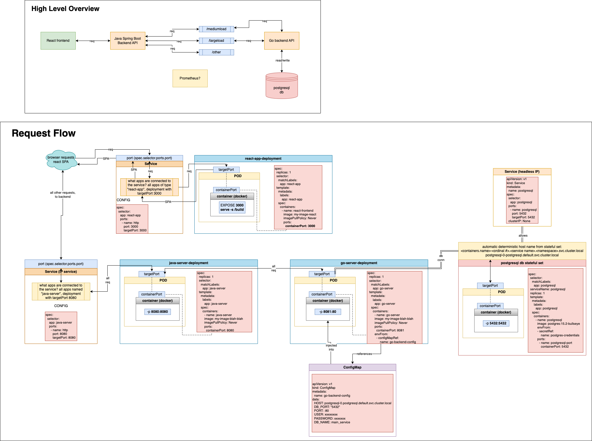

# Simple Kubernetes Setup

## Frontend
- Simple React/TS frontend SPA created with `create-react-app`.
- Allows a user to initiate load testing on the backend.
- Contains a Web Worker that pings the backend to simulate an active user environment.

## Backend
- Java Spring Boot endpoints for load testing.
- Go endpoints for load testing.
- PostgreSQL db connected to Go backend to read/write requests received from frontend.
- Prometheus monitoring and logging of the backend services (in progress).

## Images

## Purpose
Kubernetes is the industry standard software for managing apps that scale. After going through with this project, I can see how powerful it is and how it could have significantly optimized some workflows at a previous engineering team I led.

I also wanted to get my feet wet in some other popular languages.